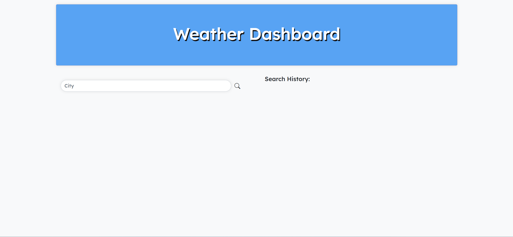
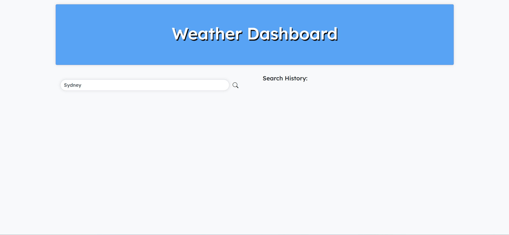
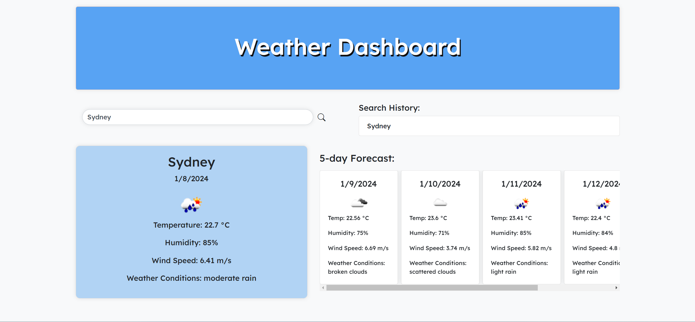

# Weather Dashboard

## Description

This Weather Dashboard is a web application that allows users to check the weather outlook for multiple cities. It features a user-friendly interface where users can search for a city and view both current and future weather conditions. The application utilizes the OpenWeatherMap API to retrieve weather data.

### Problem Solving

The Weather Dashboard addresses the need of travelers who want to plan their trips by providing up-to-date weather information for various cities. It uses third-party APIs to fetch real-time weather data and displays it in a clear and concise manner.

### Learning

While working on this project, I gained experience in working with third-party APIs, specifically the OpenWeatherMap API. I learned how to make API requests, handle responses, and dynamically update the HTML and CSS of a web page based on the retrieved data.

## Installation

To install and run this project locally, follow these steps:

1. Clone the repository to your local machine.
    
    git clone git@github.com:jodielee062788/weather-forecast-app.git

2. Open the project folder in your code editor.
3. Explore the code and open index.html in your web browser.

## Usage

1. Open the Weather Dashboard in your web browser.

    

2. Enter the name of the city you want to check the weather for in the search bar.

    

3. View the current weather conditions and 5-day forecast, including the city name, date, weather icon, temperature, humidity, wind speed, and weather condition description.

    

4. The searched city is added to the search history, and you can click on any city in the search history to view its weather conditions again. There is also a button to clear the search history.

    

    There is also a button to clear the search history.
    
    

## Live Demo

Check out the live demo of the Weather Dashboard [here](https://jodielee062788.github.io/weather-forecast-app/).

## Credits

- This project was created by Jodie Lee 
- Weather data is retrieved from the [OpenWeatherMap API](https://openweathermap.org/forecast5).
- USYD Bootcamp

## How to Contribute

If you'd like to contribute to this project, please follow these guidelines:

1. Fork the project.
2. Create a new branch for your feature or bug fix.
3. Commit your changes.
4. Submit a pull request.

